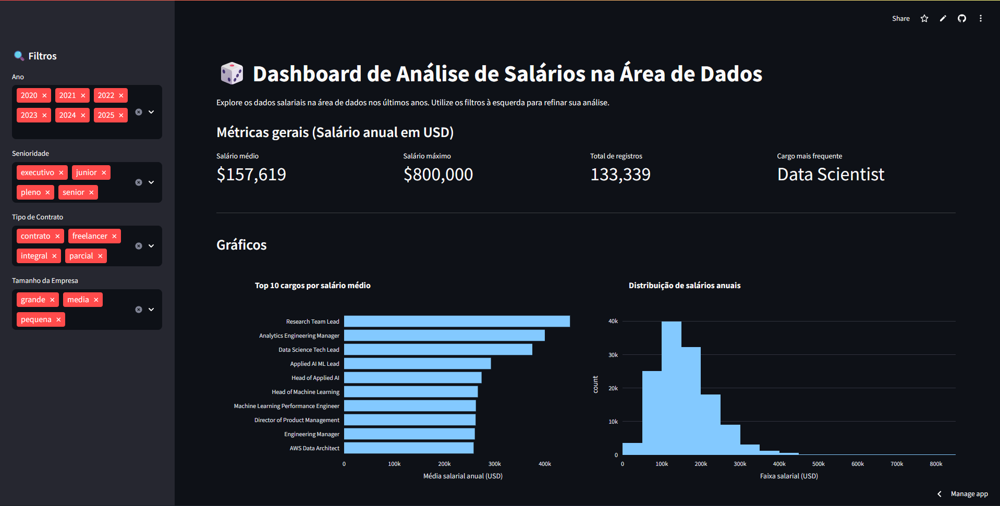

<div align="center">
  <a href="https://dashboard-interativo-alura-gui.streamlit.app">
    
  </a>
</div>

<div align="center">

# 📊 Dashboard Interativo de Salários na Área de Dados

### 🚀 Análise e visualização inteligente de salários em Data Science com filtros interativos

[](https://dashboard-interativo-alura-gui.streamlit.app/)


</div>

---

## 🎯 Sobre o Projeto

> 🎓 **Desenvolvido durante a Imersão de Dados com Python da [Alura](https://www.alura.com.br/)**

Este dashboard interativo foi criado para **democratizar o acesso a insights sobre salários na área de dados**! 🚀

### 🔍 O que você pode descobrir:

💰 **Análise Salarial Completa**
- Salários médios e máximos por posição
- Tendências salariais ao longo dos anos
- Comparação entre diferentes níveis de senioridade

📊 **Visualizações Interativas**
- Gráficos dinâmicos que respondem aos seus filtros
- Distribuição de salários por faixa
- Top 10 cargos mais bem remunerados
- Análise geográfica de salários por país

🎛️ **Filtros Inteligentes**
- **Ano**: Acompanhe a evolução temporal
- **Senioridade**: Junior, Pleno, Senior
- **Tipo de Contrato**: Tempo integral, meio período, freelance
- **Tamanho da Empresa**: Startup, média, grande corporação

> 💾 **Dados**: O dataset `dados-imersao-final.csv` contém informações consolidadas e tratadas durante as aulas da imersão.

---

## 🌐 Acesse o Dashboard Online

### 🔗 **[📱 Abrir Dashboard Interativo](https://dashboard-interativo-alura-gui.streamlit.app/)**

<div align="center">
  
  <p><em>🎨 Interface principal do dashboard com filtros e métricas</em></p>
</div>

---

## ✨ Principais Funcionalidades

### 🎛️ **Filtros Interativos**
- 📅 **Filtro por Ano**: Explore tendências temporais de 2020 a 2025
- 👥 **Nível de Senioridade**: Junior, Pleno, Senior
- 📄 **Tipo de Contrato**: Tempo integral, meio período, freelance
- 🏢 **Tamanho da Empresa**: Pequena, média e grande empresa

### 📊 **Métricas em Tempo Real** 
- 💵 **Salário Médio**: Média salarial baseada nos filtros aplicados
- 🎯 **Salário Máximo**: Maior salário encontrado na seleção
- 📈 **Total de Registros**: Quantidade de profissionais analisados
- 🏆 **Cargo Mais Frequente**: Posição mais comum nos dados filtrados

### 📈 **Visualizações Dinâmicas**
- 📊 **Top 10 Cargos**: Ranking dos cargos mais bem remunerados
- 📉 **Distribuição Salarial**: Histograma mostrando faixas de salário
- 🌍 **Mapa Global**: Salários de Data Scientists por país
- 🏠 **Trabalho Remoto**: Proporção entre presencial, remoto e híbrido

### 🎨 **Interface Amigável**
- 📱 **Design Responsivo**: Funciona perfeitamente em qualquer dispositivo
- ⚡ **Atualização Instantânea**: Gráficos se atualizam em tempo real
- 🎯 **Navegação Intuitiva**: Layout limpo e organizado

---

## 🛠️ Tecnologias e Ferramentas

<div align="center">

| Tecnologia | Versão | Descrição |
|------------|--------|-----------|
|  | 3.10+ | Linguagem principal do projeto |
|  | 1.44+ | Framework para criação do dashboard |
|  | 2.2+ | Manipulação e análise de dados |
|  | 5.24+ | Visualizações interativas |

</div> 

---

## 🖼️ Capturas de Tela do Dashboard

### 📊 **Visão Geral dos Gráficos**
<div align="center">
  
  <p><em>🎯 Visualizações dinâmicas: Top cargos, distribuição salarial, mapa mundial e modalidades de trabalho</em></p>
</div>

### 💻 **Análise no Google Colab**
<div align="center">
  
  <p><em>🔬 Processo de análise e tratamento dos dados durante a Imersão Alura</em></p>
</div>

> 📁 **Todas as imagens estão salvas na pasta `assets/` para referência visual**

---

## 📂 Estrutura do Projeto

```
📦 Dashboard_Interativo_Python/
│
├── 🎯 app.py                    # 🚀 Código principal do dashboard Streamlit
├── 📊 dados-imersao-final.csv   # 💾 Dataset tratado e consolidado  
├── 📋 requirements.txt          # 📚 Dependências do projeto
├── 📖 README.md                 # 📝 Documentação (este arquivo)
└── 🖼️ assets/                   # 🎨 Imagens e recursos visuais
    ├── imersaoAlura.png         # 🎓 Banner da Imersão Alura
    ├── dashboardInicial.png     # 📱 Tela inicial do dashboard
    ├── graficos.png             # 📊 Visualizações do dashboard
    └── colab.png                # 💻 Análise no Google Colab
```

### 📋 **Como executar localmente:**

```bash
# 1️⃣ Clone o repositório
git clone https://github.com/xguimiranda/Dashboard_Interativo_Python.git

# 2️⃣ Entre na pasta do projeto
cd Dashboard_Interativo_Python

# 3️⃣ Instale as dependências
pip install -r requirements.txt

# 4️⃣ Execute o dashboard
streamlit run app.py
```

---

## 🎓 Jornada da Imersão Alura

### 📚 **Cronograma das Aulas:**

- 🔄 **Aulas 1-3**: Limpeza e transformação dos dados
  - Tratamento de dados inconsistentes
  - Padronização de moedas para USD
  - Criação do dataset final `dados-imersao-final.csv`

- 🎨 **Aula 4**: Desenvolvimento do dashboard
  - Construção da interface em Streamlit
  - Implementação de filtros interativos  
  - Criação de visualizações dinâmicas

- 🌐 **Aula 5**: Deploy e refinamentos
  - Publicação no Streamlit Community Cloud
  - Ajustes finais na experiência do usuário
  - Otimização de performance

### 🎯 **Principais Aprendizados:**
- 📊 Análise exploratória de dados com Pandas
- 🎨 Criação de dashboards interativos com Streamlit
- 📈 Visualizações avançadas com Plotly
- 🌐 Deploy de aplicações em produção

---

## 🤝 Como Contribuir

Adoraria receber suas contribuições! 🚀 Toda ajuda é bem-vinda:

### 🔧 **Tipos de Contribuição:**
- 🐛 **Correção de bugs**
- ✨ **Novas funcionalidades** 
- 📊 **Melhorias nas visualizações**
- 📝 **Aprimoramento da documentação**
- 🎨 **Melhorias na interface**

### 📋 **Processo:**
1. 🍴 **Fork** o projeto
2. 🌿 **Crie sua branch**: `git checkout -b feature/nova-funcionalidade`
3. 💾 **Commit suas mudanças**: `git commit -m 'feat: adiciona nova funcionalidade'`
4. 📤 **Push para a branch**: `git push origin feature/nova-funcionalidade`
5. 🔄 **Abra um Pull Request**

### 💡 **Ideias para contribuir:**
- 📈 Adicionar novos tipos de gráficos
- 🔍 Implementar mais filtros de análise
- 🎨 Melhorar o design da interface
- 📊 Incluir métricas estatísticas avançadas
- 🌐 Adicionar suporte a outros idiomas

---

## 📄 Licença

Este projeto está licenciado sob a **Licença MIT** - veja o arquivo [LICENSE](LICENSE) para detalhes.

### ⚖️ **Resumo da Licença:**
- ✅ **Uso comercial permitido**
- ✅ **Modificação permitida** 
- ✅ **Distribuição permitida**
- ✅ **Uso privado permitido**

> 💡 **Sinta-se à vontade para usar, modificar e distribuir este projeto, mantendo os devidos créditos!**

---

## 👤 Autor

<div align="center">

### **Guilherme Miranda** 👨‍💻

[](https://github.com/xguimiranda)
[](https://www.linkedin.com/in/SEU-PERFIL-AQUI)

---

<div align="center">

### ⭐ **Gostou do projeto? Deixe uma estrela!** ⭐

**🔗 [Dashboard Interativo Online](https://dashboard-interativo-alura-gui.streamlit.app/)**

*Desenvolvido com ❤️ durante a Imersão de Dados Alura*

</div>

</div>
