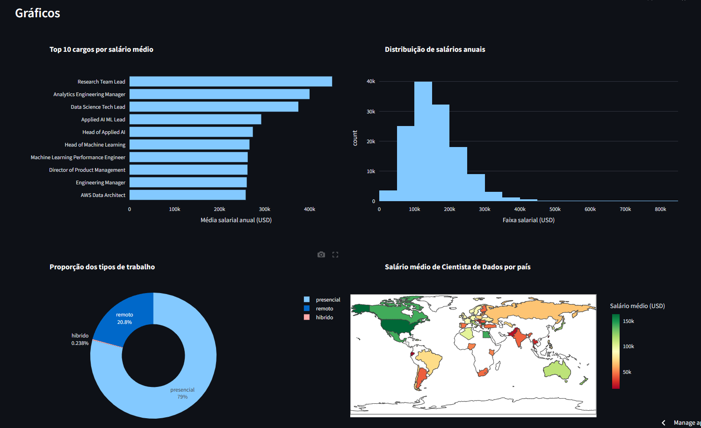

<div align="center">
  <a href="https://dashboard-interativo-alura-gui.streamlit.app">
    
  </a>
</div>

<div align="center">

# 📊 Dashboard Interativo de Salários na Área de Dados

### 🚀 Análise e visualização inteligente de salários em Data Science com filtros interativos

[](https://dashboard-interativo-alura-gui.streamlit.app/)


</div>

---

## 🎬 Demonstração Rápida


---

## 🌐 Acesse o Dashboard Online

### 🔗 **[📱 Abrir Dashboard Interativo](https://dashboard-interativo-alura-gui.streamlit.app/)**

---

## ✨ Principais Funcionalidades

### 🎛️ **Filtros Interativos**
- 📅 **Filtro por Ano**: Explore tendências temporais de 2020 a 2025
- 👥 **Nível de Senioridade**: Junior, Pleno, Senior
- 📄 **Tipo de Contrato**: Tempo integral, meio período, freelance
- 🏢 **Tamanho da Empresa**: Pequena, média e grande empresa

### 📊 **Métricas em Tempo Real** 
- 💵 **Salário Médio**: Média salarial baseada nos filtros aplicados
- 🎯 **Salário Máximo**: Maior salário encontrado na seleção
- 📈 **Total de Registros**: Quantidade de profissionais analisados
- 🏆 **Cargo Mais Frequente**: Posição mais comum nos dados filtrados

### 📈 **Visualizações Dinâmicas**
- 📊 **Top 10 Cargos**: Ranking dos cargos mais bem remunerados
- 📉 **Distribuição Salarial**: Histograma mostrando faixas de salário
- 🌍 **Mapa Global**: Salários de Data Scientists por país
- 🏠 **Trabalho Remoto**: Proporção entre presencial, remoto e híbrido

### 🎨 **Interface Amigável**
- 📱 **Design Responsivo**: Funciona perfeitamente em qualquer dispositivo
- ⚡ **Atualização Instantânea**: Gráficos se atualizam em tempo real
- 🎯 **Navegação Intuitiva**: Layout limpo e organizado

---

## 🛠️ Tecnologias e Ferramentas

<div align="center">

| Tecnologia | Versão | Descrição |
|------------|--------|-----------|
|  | 3.10+ | Linguagem principal do projeto |
|  | 1.44+ | Framework para criação do dashboard |
|  | 2.2+ | Manipulação e análise de dados |
|  | 5.24+ | Visualizações interativas |

</div> 

---

## 📊 **Visão Geral dos Gráficos**
<div align="center">
  
  <p><em>🎯 Visualizações dinâmicas: Top cargos, distribuição salarial, mapa mundial e modalidades de trabalho</em></p>
</div>

### 💻 **Análise no Google Colab**
<div align="center">
  
  <p><em>🔬 Processo de análise e tratamento dos dados durante a Imersão Alura</em></p>
</div>

> 📁 **O arquivo /dados-imersao-final.csv esta os dados com as alterações feito no google colab**

---

## 📂 Estrutura do Projeto

```
📦 Dashboard_Interativo_Python/
│
├── 🎯 app.py                    # 🚀 Código principal do dashboard Streamlit
├── 📊 dados-imersao-final.csv   # 💾 Dataset tratado e consolidado  
├── 📋 requirements.txt          # 📚 Dependências do projeto
├── 📖 README.md                 # 📝 Documentação (este arquivo)
└── 🖼️ assets/                   # 🎨 Imagens e recursos visuais
    ├── imersaoAlura.png         # 🎓 Banner da Imersão Alura
    ├── dashboardInicial.png     # 📱 Tela inicial do dashboard
    ├── graficos.png             # 📊 Visualizações do dashboard
    └── colab.png                # 💻 Análise no Google Colab
```

---

## 🤝 Como Contribuir

Contribuições, ideias novas e sugestões são sempre muito bem-vindas! Se você quiser ajudar a melhorar este projeto, fique à vontade para abrir issues, enviar pull requests ou compartilhar suas ideias.

---

## 👤 Autor

<div align="center">

### **Guilherme Miranda** 👨‍💻

[](https://github.com/xguimiranda)
[](https://www.linkedin.com/in/SEU-PERFIL-AQUI)

---

<div align="center">

### ⭐ **Gostou do projeto? Deixe uma estrela!** ⭐

*Desenvolvido com ❤️ durante a Imersão de Dados Alura*

</div>

</div>
